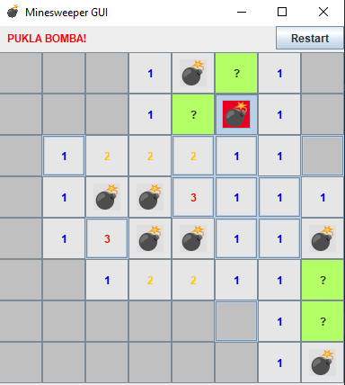

# Minesweeper GUI (Java Swing)

A simple, fully playable Minesweeper game built using Java Swing. Customizable size, real GUI, flagging, and timer.

## Features
- Custom board size and number of bombs
- Left-click to reveal, right-click to flag
- Timer starts on first click
- Restart button
- Automatic win/loss detection
- Clean GUI with colored numbers and bomb icons

## How to Run

1. Clone the repo:
   ```bash
   git clone https://github.com/andjelka-qa/MinesweeperGUI
   
2. Open it in IntelliJ or any Java IDE.
3. Ensure the resources/ folder is marked as a resources root.
4. Run Main.java.

##  Screenshot



## Author
@andjelka-qa

